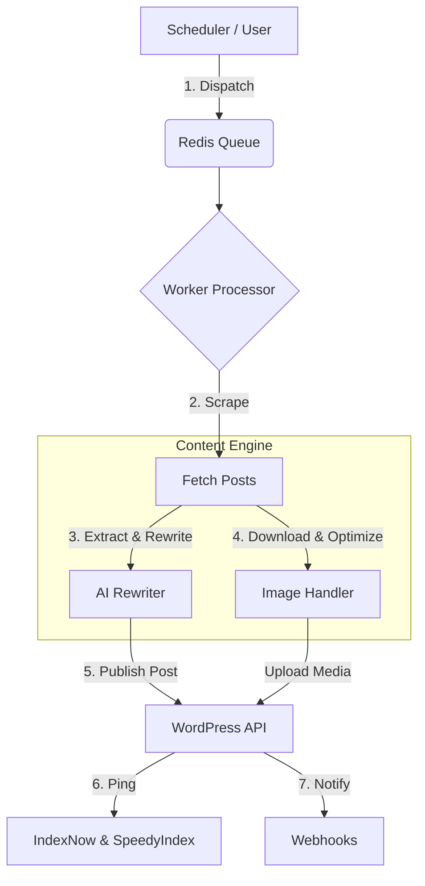

# WP AutoFlow

<div align="center">


[](https://wpautoflow.com/)
[](https://github.com/sponsors/fabioselau077)


[](https://www.gnu.org/licenses/gpl-3.0)

</div>


## 🚀 About

**WP AutoFlow** is a self-hosted platform designed to automate the lifecycle of content creation. It acts as a "Maestro," orchestrating the scraping of data sources, processing content via AI (OpenAI/DeepSeek), handling media manipulation, and publishing directly to WordPress.

Built with performance in mind, it uses a robust Queue system (BullMQ/Redis) to handle thousands of posts without crashing, ensuring your WordPress site remains fast and your content pipeline flows smoothly.

## ✨ Key Features

### 🧠 AI Content Engine
  * **Smart Rewriting:** Uses state-of-the-art LLMs (GPT-5, o3-mini, DeepSeek) to rewrite titles and content, avoiding plagiarism.
  * **Context Awareness:** Preserves the original meaning while improving SEO and readability.
  * **Internal Linking:** Automatically builds internal links based on your site's history (SEO Link Building).

### ⚡ Orchestration & Performance
  * **Queue System:** Powered by Redis & BullMQ. Handles massive workloads without timeouts.
  * **Concurrency Control:** Configurable execution modes (Sequential, Parallel, or Staggered) to prevent server overload.
  * **Robust Scheduling:** Built-in CRON scheduler to fetch new content automatically.

### 🖼️ Media Management
  * **Auto-Upload:** Extracts featured images natively, downloads, and uploads them to the WordPress Media Library.
  * **Watermarking:** Automatically applies watermarks to images before uploading.

### 🚀 SEO & Indexing
  * **Instant Indexing:** Automatically pings search engines the second a post is published.
  * **Multiple Providers:** Native support for **IndexNow** (Bing/Yandex) and [**SpeedyIndex** (Google)](https://app.speedyindex.com/r/grqnf5), including "Pay per Indexed" mode.

### 🛡️ Network & System
  * **Proxy Support:** Native support for [Scrape.do](https://scrape.do?fpr=promo) (API Mode) or Standard Tunnel Proxies.
  * **Backup & Restore:** Export and import your entire configuration and site lists via JSON for easy migrations.

### 📊 Modern Dashboard
  * **React + Vite:** A blazing fast interface to manage sites, view logs, and monitor queues.
  * **Real-time Stats:** Monitor success rates, errors, and queue status instantly.

-----

## 🛠 Tech Stack

  * **Backend:** Node.js, Express, TypeScript
  * **Frontend:** React, Vite, TailwindCSS, Lucide Icons
  * **Database:** MongoDB (Metadata & Logs)
  * **Queue/Cache:** Redis (BullMQ)
  * **Process Manager:** Docker or PM2

-----

## 📦 Installation

Choose the method that best fits your infrastructure.

### Option 1: Full Docker (Recommended) 🐳

The easiest way to get started. Runs the App, MongoDB, and Redis in isolated containers.

1.  **Clone the repository:**

    ```bash
    git clone https://github.com/fabioselau077/wp-autoflow.git
    cd wp-autoflow
    ```

2.  **Configure Environment:**

    ```bash
    cp .env.example .env
    ```

    *Note: Keep `MONGO_URI` and `REDIS_HOST` pointing to `localhost` in your .env file. The Docker configuration automatically overrides these internally.*

3.  **Start the System:**

    ```bash
    docker compose up -d --build
    ```

4.  **Access:**
    Open `http://localhost:3000` in your browser.

    > **First Login:** Creating an account is open by default on the first access (or check if you have a seeder).
    > *If you have a default admin seeder, put credentials here like:*
    > * **User:** `admin@wpautoflow.com`
    > * **Pass:** `admin123`

-----

### Option 2: Hybrid / PM2 (Performance) 🚀

Ideal for VPS usage where you want Node.js running natively for maximum performance, but keep databases in Docker.

1.  **Start Infrastructure (Mongo & Redis):**

    ```bash
    docker compose -f docker-compose.infra.yml up -d
    ```

2.  **Install & Build:**

    ```bash
    npm install
    npm run build
    ```

    *This compiles both Frontend (client) and Backend (server).*

3.  **Start with PM2:**

    ```bash
    npm install -g pm2
    pm2 start ecosystem.config.js
    pm2 save
    pm2 startup
    ```

4.  **Monitor:**

    ```bash
    pm2 logs wp-autoflow
    ```

-----

### Option 3: Development Mode 🧑‍💻

For contributors who want to modify the code with Hot-Reload.

1.  **Start Dev Environment:**
    ```bash
    docker compose -f docker-compose.dev.yml up --build
    ```
    *This enables hot-reloading for the backend code. Run `npm run dev` inside the `/client` folder for Frontend hot-reloading.*

-----

## ⚙️ Configuration

Create a `.env` file in the root directory using `.env.example` as a template.

```ini
# Server Configuration
PORT=3000
NODE_ENV=production

# Database (Default: localhost)
# If running via Full Docker, the system automatically routes this to the 'mongo' container.
MONGO_URI=mongodb://localhost:27017/wp-autoflow

# Queue System (Default: localhost)
REDIS_HOST=localhost
REDIS_PORT=6379

# Security
JWT_SECRET=change_this_to_a_secure_random_string
```

## 🏗️ Architecture

WP AutoFlow follows a **Producer-Consumer** pattern to ensure stability.



## 🤝 Contributing

Contributions are welcome\! Please follow these steps:

1.  Fork the project.
2.  Create your feature branch (`git checkout -b feature/AmazingFeature`).
3.  Commit your changes (`git commit -m 'Add some AmazingFeature'`).
4.  Push to the branch (`git push origin feature/AmazingFeature`).
5.  Open a Pull Request.

## 📄 License

This project is licensed under the **GNU General Public License v3.0 (GPLv3)**.

You are free to:
* **Use** privately or commercially.
* **Modify** the code.
* **Distribute** copies.

Under the following conditions:
* **Source Code:** You must disclose the source code of your modified version.
* **License:** Your modified version must also be licensed under GPLv3.
* **Attribution:** You must keep the original copyright and author credits.

See `LICENSE` for more information.

-----

**WP AutoFlow** - Automate. Orchestrate. Dominate.
